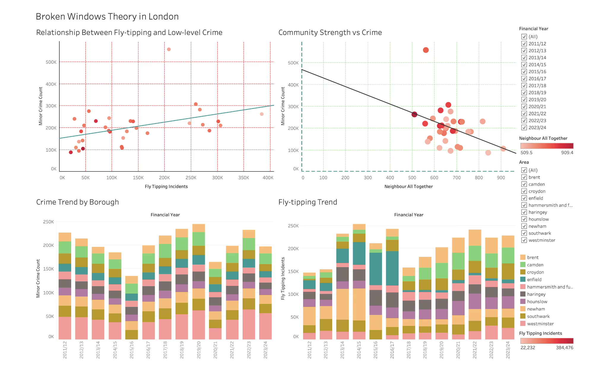

# Broken Windows Theory London: Azure Lakehouse Platform

> End-to-End Azure Data Engineering Solution using Azure Data Factory, ADLS Gen2, Azure Databricks, PySpark, MLflow and Tableau.


---

## Project Overview

This project investigates **Broken Windows Theory** across London boroughs by analysing the relationship between:

- Crime levels
- Environmental disorder (Fly-Tipping Incidents)
- Community Strength Indicators

The solution was built using a modern Azure Lakehouse architecture and follows the **Medallion Architecture (Bronze → Silver → Gold)** pattern.

---

## Business Objective

Broken Windows Theory suggests that visible signs of disorder and neglect contribute to increased crime.

This project aims to answer:

> Is there a measurable relationship between environmental disorder, community cohesion and crime levels across London boroughs?

---

## Architecture

```text
MPS Crime Dataset
Fly-Tipping Dataset
Community Strength Dataset
          │
          ▼
Azure Data Factory
          │
          ▼
ADLS Gen2 Bronze Layer
          │
          ▼
Azure Databricks (PySpark)
          │
          ▼
ADLS Gen2 Silver Layer
          │
          ▼
ADLS Gen2 Gold Layer
          │
    ┌─────┴─────┐
    ▼           ▼
 MLflow      Tableau
Analytics   Dashboard
```

---

## Technology Stack

### Cloud & Data Engineering

- Azure Data Factory
- Azure Data Lake Storage Gen2
- Azure Databricks
- PySpark
- Delta Lake

### Analytics

- MLflow
- Scikit-Learn
- OLS Regression
- Pearson Correlation

### Visualization

- Tableau

### Development

- Git
- GitHub

---

## Azure Infrastructure

| Resource | Purpose |
|-----------|----------|
| Azure Data Factory | Pipeline orchestration |
| ADLS Gen2 | Data Lake Storage |
| Azure Databricks | Data processing & analytics |
| Bronze Container | Raw data |
| Silver Container | Cleaned data |
| Gold Container | Analytics-ready data |
| MLflow | Experiment tracking |
| Tableau | Data visualization |

---

## Datasets

### Metropolitan Police Crime Dataset

Historical borough-level crime records from London.

### Fly-Tipping Dataset

Environmental disorder indicator measuring illegal waste disposal incidents.

### Community Strength Dataset

Contains borough-level indicators:

- Neighbourhood cohesion
- Local belonging
- Volunteering
- Social support

---

## Medallion Architecture

### Bronze Layer

Stores raw source files.

```text
bronze/
│
├── mps_crime/
├── fly_tipping/
└── community_strength/
```

### Silver Layer

Data cleansing and standardisation.

Transformations include:

- Null handling
- Data type conversion
- Borough standardisation
- Schema alignment

### Gold Layer

Business-ready analytical dataset created through multi-source joins.

Final Output:

```text
gold/
└── Gold_Broken_Windows.csv
```

---

## Azure Data Factory Pipeline

The ingestion pipeline consists of four stages:

1. Copy_MPS_Crime
2. Copy_Fly_Tipping
3. Copy_Community_Strength
4. Run_Databricks_Transformation

---

## Databricks Workflow

### Notebook 00

**Configuration**

- ADLS Connection
- Path Variables

### Notebook 01

**Bronze Validation**

- Schema Checks
- Record Counts

### Notebook 02

**Bronze → Silver**

- Cleaning
- Standardisation
- Transformation

### Notebook 03

**Silver → Gold**

- Dataset Joins
- Feature Creation

### Notebook 04

**Analytics**

- Correlation Analysis
- OLS Regression
- MLflow Tracking

---

## Data Quality Framework

### Quality Checks

- Null Value Validation
- Borough Name Standardisation
- Data Type Validation
- Join Validation
- Schema Consistency

### Data Quality Results

| Dataset | Raw Rows | Clean Rows |
|----------|----------|------------|
| MPS Crime | 1084 | 476 |
| Fly-Tipping | 429 | 424 |
| Community Strength | 33 | 33 |
| Gold Dataset | 411 | 411 |

---

## MLflow Experiment Tracking

MLflow was used to track:

- R² Score
- MAE
- Cross Validation Score
- Correlation Metrics

Benefits:

- Reproducibility
- Auditability
- Experiment Management

---

## Statistical Analysis

### Pearson Correlation

| Relationship | Correlation |
|-------------|------------|
| Fly-Tipping vs Crime | +0.28 |
| Neighbour All Together vs Crime | -0.31 |
| Belonging Index vs Crime | -0.30 |
| People Help Available vs Crime | -0.07 |

---

## Regression Analysis

Model:

- Ordinary Least Squares (OLS)

Performance:

| Metric | Value |
|---------|--------|
| R² | 0.20 |
| Cross-Validated R² | 0.16 |
| MAE | 4195.8 |

---

## Tableau Dashboard

### Features

- Fly-Tipping vs Crime Analysis
- Community Strength vs Crime
- Crime Trend by Borough
- Fly-Tipping Trend
- Broken Windows Story Dashboard

### Dashboard Screenshot



---

## Key Findings

### Positive Association

- Fly-Tipping incidents show a positive relationship with crime levels.

### Negative Association

- Community cohesion indicators show negative relationships with crime.

### Conclusion

The findings provide **partial support for Broken Windows Theory**, suggesting that environmental disorder and community strength influence crime patterns, although broader socioeconomic factors also contribute significantly.

---

## Project Structure

```text
broken-windows-theory-london-azure-lakehouse/

├── architecture/
│   └── broken_windows_architecture.png
│
├── datasets/
│   ├── CST_Data.csv
│   ├── Fly-tipping-borough.csv
│   └──MPS Brough Level Crime.csv
│
├── notebooks/
│   ├── 00_config.ipynb
│   ├── 01_bronze_check.ipynb
│   ├── 02_silver_transform.ipynb
│   ├── 03_gold_join.ipynb
│   └── 04_analysis.ipynb
│
├── architecture/
│   └── broken_windows_architecture.png
│
├── screenshots/
│   ├── 01-adf-pipeline.png
│   ├── 02-databricks.png
│   ├── 03-mlflow.png
│   ├── 04-crime-trend.png
│   ├── 05-fly-tipping vs LL crime.png
│   ├── 06-correlation-analysis.png
│   ├── 07-CS vs low level crime.png
│   └── 08-tableau-dashboard.png
│
└── README.md
```

---

## Skills Demonstrated

- Azure Data Factory
- Azure Data Lake Storage Gen2
- Azure Databricks
- PySpark
- Delta Lake
- ETL / ELT
- Data Quality Engineering
- Data Modelling
- Statistical Analysis
- MLflow
- Tableau
- Medallion Architecture
- Git & GitHub

---

## Author

**Ram**
