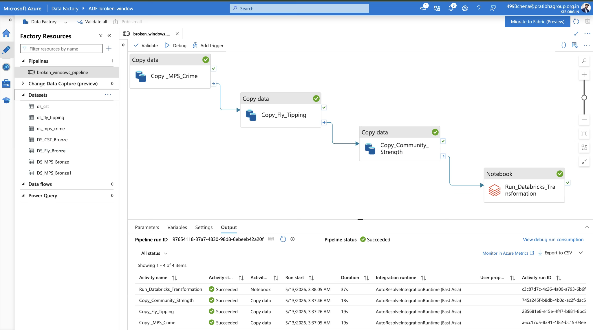
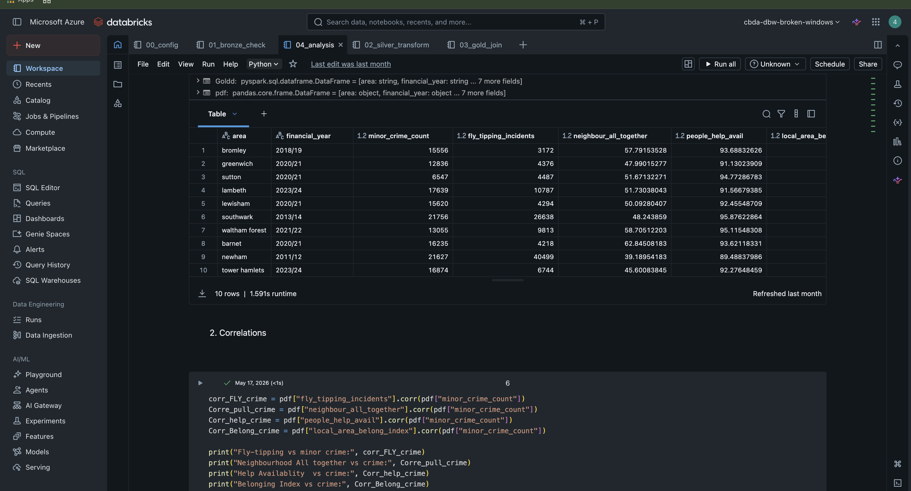

# Broken Windows Theory in London: Azure Lakehouse Platform

An end-to-end Azure data engineering and analytics project that investigates whether environmental disorder and community cohesion are associated with low-level crime across London boroughs.

The solution uses Azure Data Factory, Azure Data Lake Storage Gen2, Azure Databricks, PySpark, Delta Lake, MLflow, and Tableau to implement a Medallion Architecture from raw ingestion through business-ready analysis.

## Project overview

| Area | Implementation |
|---|---|
| Business question | Are fly-tipping and community-strength indicators associated with low-level crime across London boroughs? |
| Data sources | Metropolitan Police crime, borough-level fly-tipping, and community-strength indicators |
| Architecture | Azure Lakehouse using Bronze, Silver, and Gold layers |
| Orchestration | Azure Data Factory |
| Storage | Azure Data Lake Storage Gen2 |
| Processing | Azure Databricks, PySpark, and Delta Lake |
| Analytics | Pearson correlation, OLS regression, five-fold cross-validation, and MLflow tracking |
| Visualisation | Interactive Tableau dashboard |

## Architecture


```text
MPS crime CSV ──────────┐
Fly-tipping CSV ────────┼──> Azure Data Factory ──> ADLS Gen2 Bronze
Community-strength CSV ─┘                              │
                                                       ▼
                                             Azure Databricks / PySpark
                                                       │
                                  Bronze ──> Silver Delta ──> Gold Delta
                                                       │
                                    ┌──────────────────┴──────────────────┐
                                    ▼                                     ▼
                              MLflow tracking                 Databricks SQL / export
                                                                          │
                                                                          ▼
                                                                  Tableau dashboard
```

The pipeline separates ingestion, transformation, analytics, and presentation concerns. Raw files remain available in Bronze, standardised Delta tables are written to Silver, and the joined borough-year analytical model is stored in Gold.

## Data pipeline

### 1. Ingestion — Azure Data Factory

Azure Data Factory orchestrates ingestion of the three source files into dedicated ADLS Gen2 Bronze paths:

```text
bronze/broken_windows/raw/
├── mps_crime/
├── fly_tipping/
└── community_strength/
```



### 2. Bronze — raw data

The Bronze layer preserves the source CSV files without applying business transformations. The validation notebook checks that the expected objects are present before downstream processing begins.

### 3. Silver — cleaning and standardisation

PySpark transformations perform:

- Schema inference and data-type conversion
- Null and invalid-value filtering
- Borough-name cleaning and standardisation
- Wide-to-long reshaping of monthly MPS crime columns
- Calendar-month to financial-year conversion
- Selection and aggregation of low-level crime categories
- Standardisation of fly-tipping and community-strength features
- Delta Lake writes for each cleaned domain table

```text
silver/broken_windows/
├── Silver_MPS_minor_crime/
├── silver_fly_tipping/
└── silver_community_strength/
```

### 4. Gold — integrated analytical model

The Gold notebook joins crime and fly-tipping data by standardised borough and financial year, then joins community-strength indicators by borough.

```text
gold/broken_windows/
├── Gold_Borough_Year/    # Delta table
└── Export_tab/           # CSV export for BI tools
```

The resulting table has one row per available borough and financial year, with measures for low-level crime, fly-tipping, and community-strength indicators.

## Datasets and data quality

| Dataset | Grain | Raw rows | Rows after preparation |
|---|---|---:|---:|
| MPS borough-level crime | Crime category by borough with monthly columns | 1,084 | 476 borough-year aggregates |
| Fly-tipping | Borough and financial year | 429 | 424 |
| Community strength | Borough snapshot | 33 | 33 |
| Gold analytical dataset | Borough and financial year | — | 411 |

Quality controls include:

- Required-file and schema checks
- Null validation
- Numeric type enforcement
- Borough-name normalisation
- Financial-year format alignment
- Join-count validation
- Gold-table schema and record-count checks

The row counts above describe the recorded pipeline run represented by this repository.

## Notebook workflow

Run the Databricks notebooks in order:

| Notebook | Responsibility |
|---|---|
| [`00_config.ipynb`](notebooks/00_config.ipynb) | ADLS connection, container names, and shared paths |
| [`01_bronze_check.ipynb`](notebooks/01_bronze_check.ipynb) | Bronze file and ingestion validation |
| [`02_silver_transform.ipynb`](notebooks/02_silver_transform.ipynb) | Cleaning, reshaping, standardisation, aggregation, and Silver Delta writes |
| [`03_gold_join.ipynb`](notebooks/03_gold_join.ipynb) | Join-key normalisation, multi-source integration, and Gold outputs |
| [`04_analysis.ipynb`](notebooks/04_analysis.ipynb) | Correlation, regression, cross-validation, visualisation, and MLflow logging |



## Analytics and results

### Correlation analysis

| Relationship with low-level crime | Pearson correlation |
|---|---:|
| Fly-tipping incidents | **+0.28** |
| Neighbours pull together | **−0.31** |
| Local-area belonging index | **−0.30** |
| Help available | **−0.07** |

The recorded analysis shows a modest positive association between fly-tipping and low-level crime, while stronger community-cohesion measures show modest negative associations.

### OLS regression

The regression model uses fly-tipping and five community-strength indicators to predict aggregated low-level crime counts.

| Metric | Recorded value |
|---|---:|
| Training R² | 0.20 |
| Mean five-fold CV R² | 0.16 |
| CV R² standard deviation | 0.04 |
| Training MAE | 4,195.8 crime incidents |

The relatively low R² indicates that the selected disorder and community variables explain only part of the variation in crime. Socioeconomic, demographic, policing, reporting, and temporal factors are not fully represented in this model.

### MLflow experiment tracking

MLflow records model-quality and correlation metrics for reproducibility and comparison:

- Training R² and MAE
- Cross-validated R² mean and standard deviation
- Fly-tipping correlation
- Neighbourhood-cohesion correlations


## Tableau dashboard

The dashboard provides interactive views of:

- Fly-tipping versus low-level crime
- Community strength versus crime
- Crime trends by borough and financial year
- Fly-tipping trends by borough and financial year
- Borough and year filters for comparative analysis


## Key findings

- Higher fly-tipping levels are associated with higher low-level crime in the joined data, but the relationship is modest.
- Stronger neighbourhood cohesion and local belonging are associated with lower crime counts.
- The multivariate model has limited explanatory power, so the evidence provides only partial support for the Broken Windows hypothesis in this dataset.
- The analysis identifies relationships, not causal effects. It does not establish that environmental disorder causes crime.

## Analytical limitations

- Community-strength data contains a single borough-level observation period and is treated as static when joined across financial years.
- Borough-level aggregation can hide variation within neighbourhoods.
- Crime figures may be affected by reporting behaviour and policing practices.
- Fly-tipping and crime counts can both be influenced by population size and other unmodelled borough characteristics.
- Random five-fold cross-validation does not explicitly model the temporal and grouped structure of borough-year observations.
- The results should therefore be interpreted as exploratory evidence rather than policy or causal conclusions.

## Repository structure

```text
Broken Windows Theory London: Azure Lakehouse Platform/
├── architecture/
│   └── Architecture BWTL .png
├── datasets/
│   ├── CST_Data.csv
│   ├── MPS Borough Level Crime (Historical).csv
│   └── fly-tipping-borough.csv
├── notebooks/
│   ├── 00_config.ipynb
│   ├── 01_bronze_check.ipynb
│   ├── 02_silver_transform.ipynb
│   ├── 03_gold_join.ipynb
│   └── 04_analysis.ipynb
├── screenshots/
│   ├── 01_ADF_pipeline.png
│   ├── 02-databricks.png
│   ├── 03_ML flow.png
│   ├── 04_Crime-trend.png
│   ├── 05_Fly-tipping vs Low-level_crime.png
│   ├── 06_Correlation-analysis.png
│   ├── 07_CS vs Low-level_crime.png
│   └── 08_Tableau-Dashboard.png
└── README.md
```

## Reproducing the project

### Prerequisites

- An Azure subscription
- Azure Data Factory
- Azure Data Lake Storage Gen2 with `bronze`, `silver`, and `gold` containers
- An Azure Databricks workspace with a Spark cluster and Delta Lake support
- A Databricks secret scope containing the ADLS access credential
- Python packages available for Pandas, Matplotlib, scikit-learn, and MLflow
- Tableau Desktop or another compatible BI client for the final dashboard

### Setup

1. Clone the repository and open the project directory.
2. Recreate the ADF ingestion flow shown in the pipeline screenshot, or use an equivalent process to place the three CSV files in their corresponding Bronze paths.
3. Import the five notebooks into the same Azure Databricks workspace directory.
4. In `00_config.ipynb`, set the storage-account name and replace the secret-scope placeholders with your Databricks secret configuration.
5. Confirm that the Bronze, Silver, and Gold container names match your Azure environment.
6. Run notebooks `00` through `04` in sequence.
7. Connect Tableau to the Gold export or expose the Gold table through a Databricks SQL Warehouse.

Do not place storage keys, connection strings, or other credentials directly in notebooks or Git. Use Azure Key Vault or Databricks secret scopes.

## Skills demonstrated

- Azure Data Factory orchestration
- ADLS Gen2 lakehouse design
- Medallion Architecture
- Azure Databricks and PySpark
- Delta Lake table management
- ETL/ELT and data-quality validation
- Multi-source data modelling
- MLflow experiment tracking
- Statistical analysis with scikit-learn
- Tableau dashboard development

## Responsible interpretation

This project analyses aggregate public-sector indicators for educational and portfolio purposes. Its statistical results should not be used to label communities, predict individual behaviour, or justify operational policing decisions.
